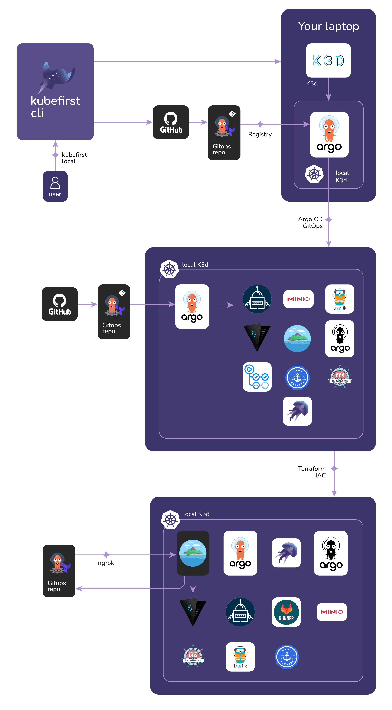

# ArgoCD con Kubefirst demo

[](./README.md)
[](./README-es.md)

[Kubefirst](https://kubefirst.io/) es una plataforma de GitOps que instala las herramientas más populares del mercado en cuestión de minutos 🚀.



## Instalación

Instala Kubefirst con Homebrew

```bash
brew install kubefirst/tools/kubefirst
brew install mkcert
mkcert -install
```

## What is K3d?

K3d es un wrapper para correr K3s (Distribución mínima de Kubernetes hecha por Rancher) en Docker. K3d hace más fácil crear un cluster de uno o multiples nodos para desarollo local.

## Creando nuestro ambiente local de K3d

Para crear nuestro ambiente en K3d necesitamos unos cuantos prerequisitos:

1. Tener instalado Docker y funcionando.
2. Una cuenta de GitHub y un GITHUB_TOKEN expuesto en nuestra terminal.

Simplemente corremos el siguiente comando:

```bash
kubefirst k3d create
```

## Credenciales de la infraestructura

Si necesitas obtener las credenciales de los sistemas que Kubefirst instaló puedes usar el comando:

```bash
kubefirst k3d root-credentials


  ----------------------------------------------------------------------
  k3d Authentication

  Keep this data secure. These passwords can be used to access the
  following applications in your platform.
  ----------------------------------------------------------------------

  Argo CD admin Password: password

  KBot User Password: random

  Vault root Token: randomtoken
```
